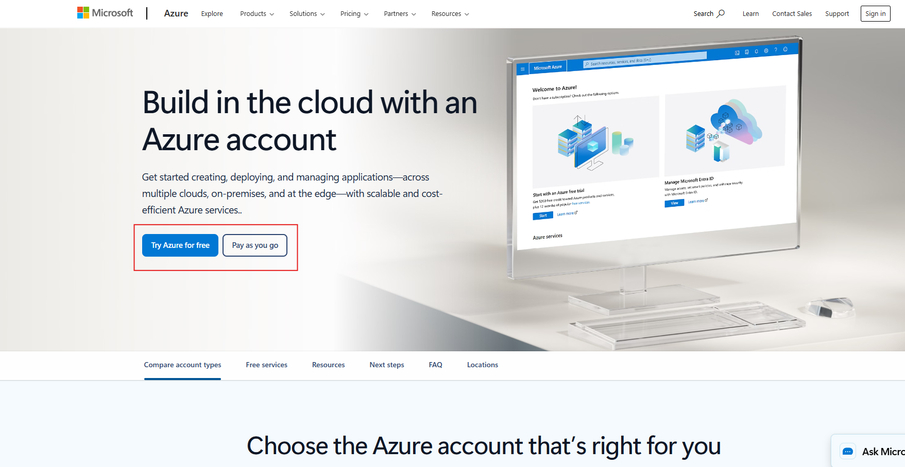
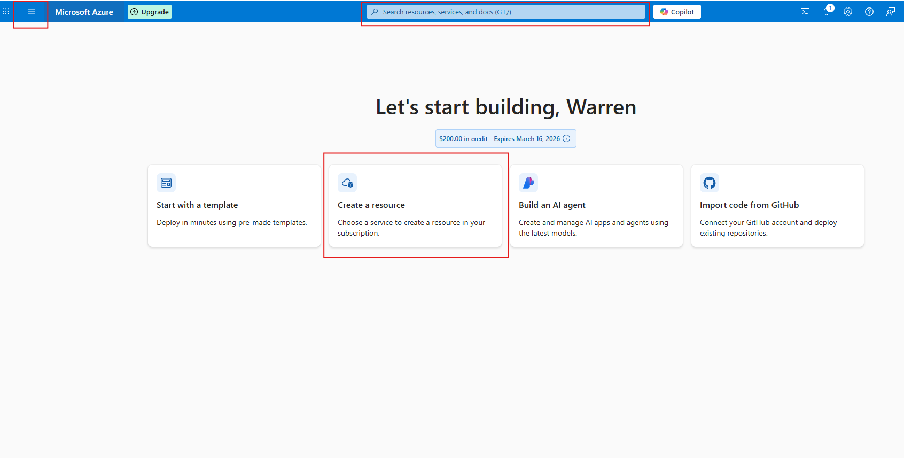
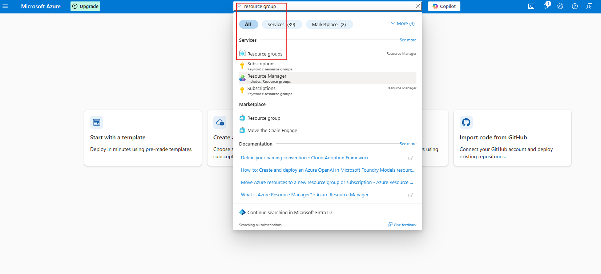
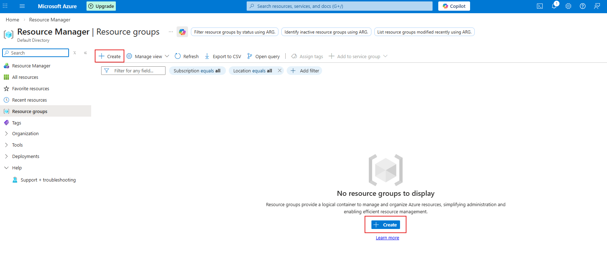
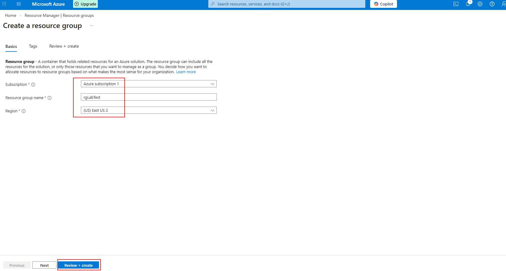
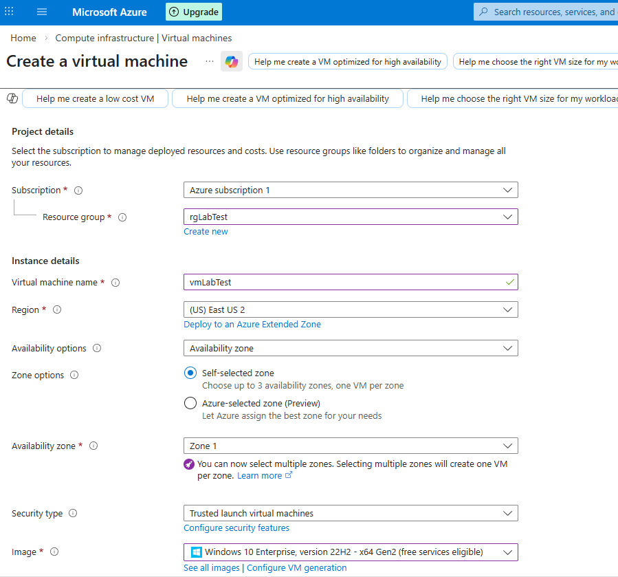
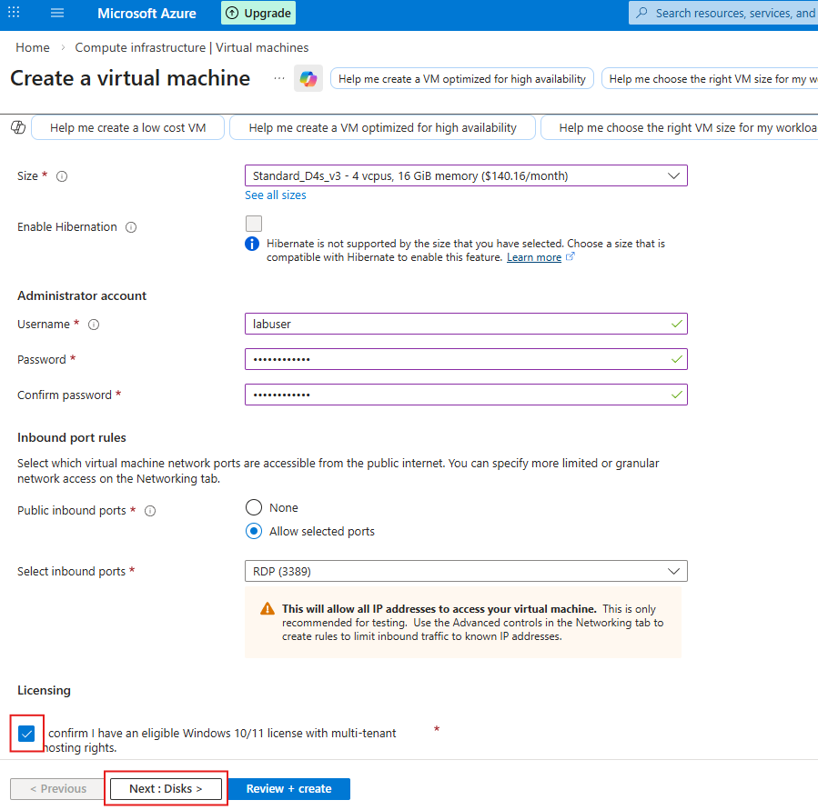
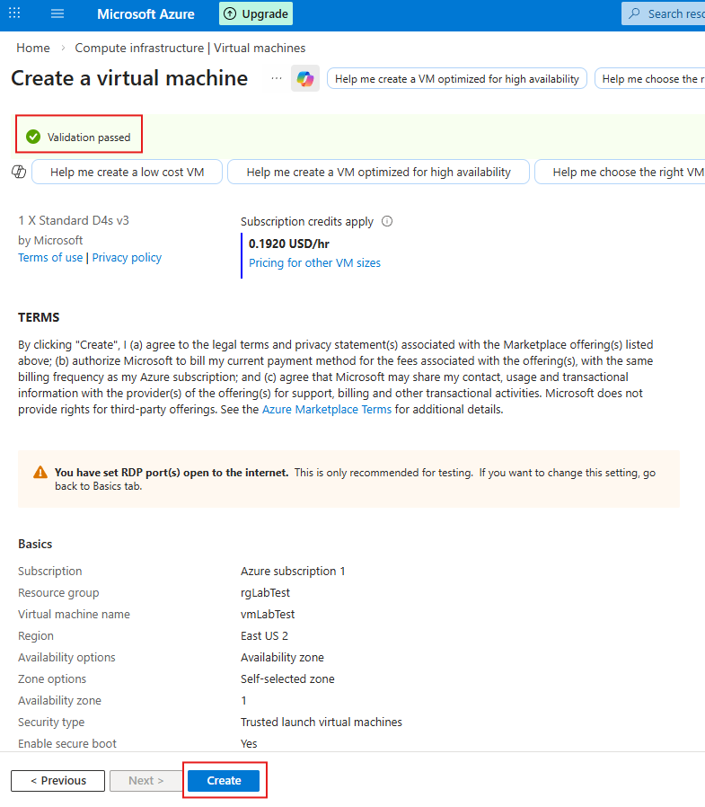
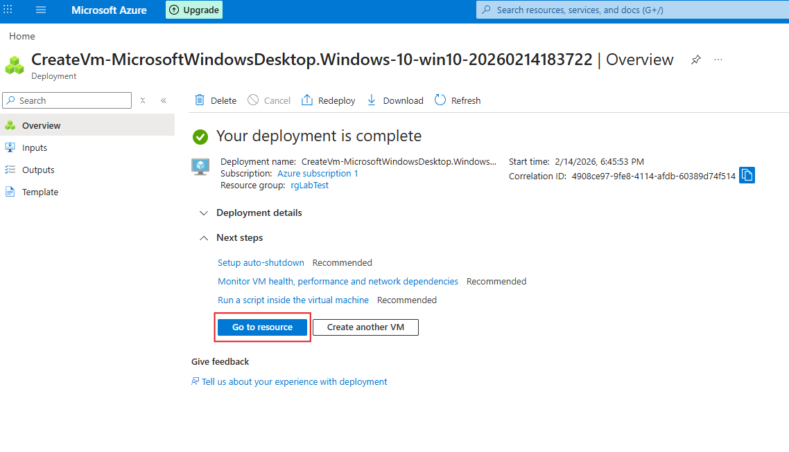

  

<h1> Creating a Windows Virtual machine in Azure Portal </h1>
<h2> What are Virtual Machines </h2>

Virtual Machines are computer that runs inside another computer over the internet. You can install an operating system, run software, host websites, and perform tasks just like you would on a normal PC or server.

<h2> About this Project </h2>
The main objective of this project is to familiarize MS Azure's portal and environment, how Virtual Machine works and how to create one. Here, we will also learn how to connect to a VM using Remote Desktop.

<h2> Environment and Technology used </h2>

- Microsoft Azure
- Windows O.S
- Remote Desktop

<h2> Getting Started </h2>

<h3> 1. Create a free subscription or Pay As You Go subscription at https://azure.microsoft.com/en-us/free/ </h3>

  

<h3> 2. Familiarizing the MS Azure homepage.</h3>

- Login to Azure Portal: https://portal.azure.com
- Ways to access all MS Azure services:
     - Click Create a resource > All services. (Shows all available Azure services)
     - Click the three horizontal bars at the very top left of the page, then the Favorites and mostly used services including other options of the website drops down.
     - And lastly by using the Search bar at the very top part of the page.

     

     
<h3> 3. Creating Virtual machine and it's Resource group</h3>

- Type in the Search bar "resource group".
- Click the "+" sign to Create a New resource group.
- You will be redirected to the Create a resource group page.
- Select Azure subscription 1 for the subscription text box.
- Type-in *rgLabTest* for the Resource group name.
- Under Region, you can use East US 2 or any other region, just make sure you are using the same one for your vm and network RG.
- Click on Review + create button, then hit Create.
- To check your newly created resource group *rgLabTest*, Serch resource group and verify if you have it.

     
     
     

- To create a new VM, type in the search bar virtual machine.
- Click on the + create button, and select Virtual machine.
- Enter/Select the following on their respective textboxes:
     - Subscription: Azure subscription 1
     - Resource group: rgLabTest
     - Virtual machine name: vmLabTest
     - Availability zone: Zone 1 *(you can choose a diff zone if you want)*
     - Image: Windows 10 Ent, version 22H2 - x64 Gen2 *look for any Windows that won't give you errors*
     - Size: Standard_D4s_v3 - 4 vcpus, 16GB RAM *(option2: 2 vcpus, 8gb RAM)*
     - Username: labuser
     - Password: LabtechPass1

     
     
     

- Make sure to tick Licensing checkbox, then click Review + create
- When you get the green check mark Validation passed message, Click Create.
- And after the deployment, click Got to resource and verify if successful. 

     
     

<h2>Finishing Up</h2>
<h3>Congratulations for successfully creating your first Virtual Machine in Azure. Azure VM dashboard shown below.</h3>

*Having issues and trouble setting up your virtual machine? Please reach out to paulo@maglana.com*

